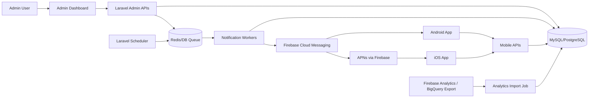
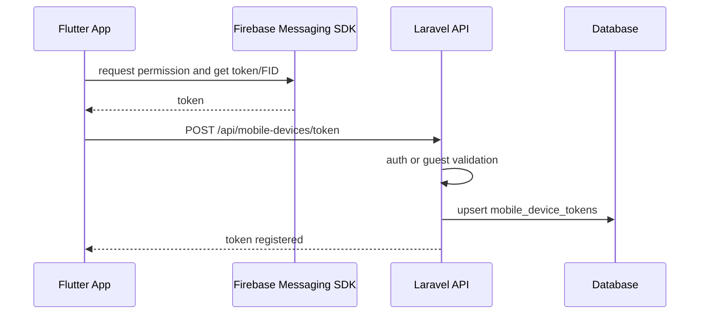
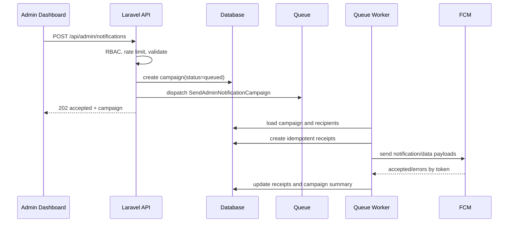
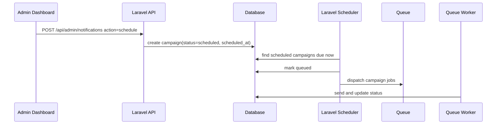
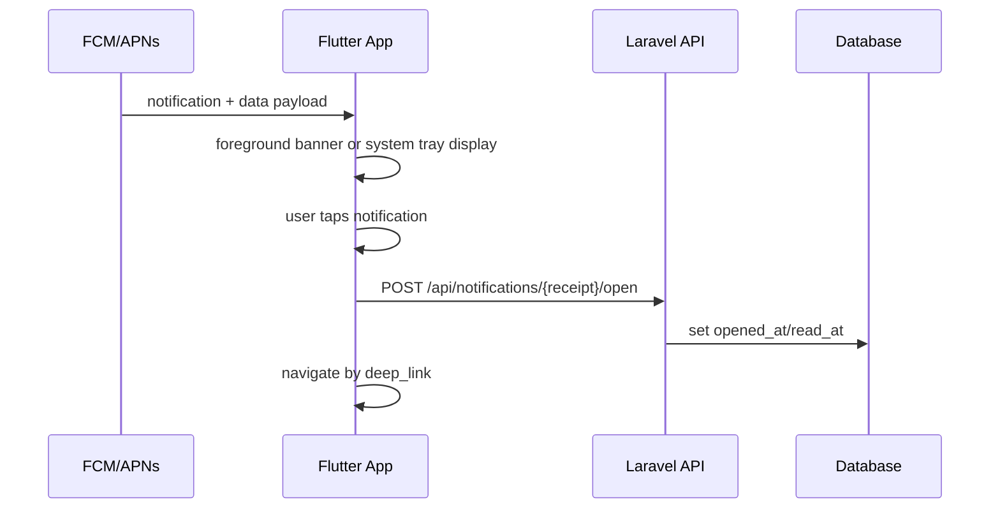

# Admin Notification System Specification

Date: 2026-07-22

## 1. Scope And Stack

This specification describes a production-ready admin notification system for KY Service Center. It lets authorized administrators compose, schedule, send, resend, cancel, and analyze push notifications sent to customers using the Flutter mobile app on Android and iOS.

Chosen stack for this repository:

- Backend: Laravel 12 / PHP 8.2, Sanctum/admin middleware, Kreait Firebase PHP SDK, database or Redis queues.
- Mobile: Flutter with `firebase_core`, `firebase_messaging`, `flutter_local_notifications`, and a server-backed notification center.
- Admin dashboard: current Laravel Blade + Vite/Alpine dashboard. If the admin app later moves to a component SPA, Vue 3 is the lowest-friction choice with Laravel Vite.
- Push provider: Firebase Cloud Messaging for Android and iOS, with APNs configured inside Firebase for iOS delivery.

Current repository baseline already includes:

- `backend/app/Http/Controllers/AdminNotificationController.php`
- `backend/app/Services/AdminNotificationCampaignSender.php`
- `backend/app/Services/FirebasePushNotificationService.php`
- `backend/app/Jobs/SendAdminNotificationCampaign.php`
- `backend/routes/console.php` scheduler command `notifications:send-due`
- `app_ky_service_center/lib/services/app_notification_service.dart`
- `app_ky_service_center/lib/screens/notifications/notification_screen.dart`
- `app_ky_service_center/lib/screens/notifications/admin_notification_panel_screen.dart`

The remaining production hardening is: generalized receipt schema, category preferences, analytics import, cancellation/resend endpoints, batch fan-out jobs, stricter deep-link validation, and richer dashboard analytics.

## 2. Functional Requirements

### Notification Types

Supported categories:

- `order_update`: order confirmed, shipped/out for delivery, delivered, cancelled.
- `promotion`: discounts, flash sales, new products, vouchers.
- `announcement`: maintenance, policy changes, app updates, general support notices.

Recommended display type values:

- `Order Update`
- `Promotion`
- `Announcement`
- `Alert`
- `Reminder`

Internally store a stable enum (`order_update`, `promotion`, `announcement`, `alert`, `reminder`) and keep display labels in UI/localization.

### Admin Dashboard

Admin capabilities:

- Compose title, body, optional image/media URL or upload, deep link.
- Choose notification category/type.
- Target audience:
  - all users and guest devices with registered FCM tokens.
  - registered users only.
  - guest devices only.
  - segments by location, activity, order history, role, or custom filters.
  - individual users by email, phone, or user ID.
- Send now or schedule future delivery.
- Preview iOS and Android notification appearance.
- View history with status, targeted count, FCM accepted count, failed count, opened count, open rate, created by, scheduled time.
- Resend sent notifications as a new campaign.
- Cancel scheduled notifications before dispatch.
- Filter analytics by type, date range, audience, status, and segment.

### Mobile App

Mobile capabilities:

- Register FCM token with backend for authenticated users and guest devices.
- Receive notifications in foreground, background, and terminated states.
- Foreground: show an in-app/local banner using `flutter_local_notifications`.
- Background/terminated: let system notification display from FCM notification payload.
- Tap notification and navigate by deep link.
- Store/fetch notification history for notification center.
- Mark opened/read when user taps or views a notification.
- Let users opt in/out by category.

### Backend

Backend capabilities:

- Validate, store, schedule, and send notification campaigns.
- Resolve audiences.
- Respect user category preferences before creating receipts/sending pushes.
- Fan out asynchronously using queue jobs.
- Store one receipt/inbox row per recipient for idempotency and analytics.
- Send FCM notification + data payloads.
- Track FCM acceptance, failures, invalid tokens, reads/opens, and BigQuery/Firebase analytics imports.
- Rate limit admin send APIs.
- Audit every create/send/resend/cancel action.

## 3. Architecture



### Core Components

- `NotificationCampaign`: admin-authored payload and delivery plan.
- `NotificationReceipt`: per-recipient/per-device record used for inbox and analytics.
- `MobileDeviceToken`: registered FCM token or Firebase Installation ID, platform, owner, guest ID, last seen.
- `NotificationPreference`: user category opt-in/out state.
- `SendAdminNotificationCampaign`: queued job that moves a campaign through `queued -> sending -> sent/partial/failed`.
- `SendNotificationBatch`: recommended next job that sends chunks of up to 500 FCM targets.
- `FirebasePushNotificationService`: FCM message builder and delivery adapter.
- `AnalyticsImportNotificationMetrics`: imports Firebase/BigQuery delivery and open metrics.

## 4. Data Flow

### Token Registration



### Send Now



### Scheduled Delivery



### Receive And Open



## 5. Database Design

The current repo uses `admin_notification_campaigns` for campaign metadata and `order_tracking_notifications` as a stored notification/inbox table. For long-term maintainability, create generalized `notifications` and `notification_receipts` tables, or keep the existing table names and add equivalent columns. A clean v2 schema is below.

### `notifications`

Stores the admin-authored campaign/draft/schedule.

| Column | Type | Notes |
| --- | --- | --- |
| id | bigint PK | |
| uuid | uuid/string unique | public API identifier |
| admin_user_id | FK nullable | creator |
| type | string | `order_update`, `promotion`, `announcement`, `alert`, `reminder` |
| title | string(150) | sanitized plain text |
| body | text | sanitized plain text |
| image_url | string(2048) nullable | HTTPS URL or uploaded media URL |
| deep_link | string(1000) nullable | app route or allowed HTTPS URL |
| audience_type | string | `all`, `registered`, `guests`, `segment`, `custom_users` |
| audience_params | json nullable | segment filters, user IDs, location filters |
| scheduled_at | timestamp nullable | UTC |
| sent_at | timestamp nullable | UTC |
| cancelled_at | timestamp nullable | UTC |
| status | string | `draft`, `scheduled`, `queued`, `sending`, `sent`, `partial`, `failed`, `cancelled` |
| idempotency_key | string nullable | prevents duplicate sends |
| target_count | unsigned int default 0 | resolved recipients |
| fcm_accepted_count | unsigned int default 0 | accepted by FCM, not guaranteed device display |
| failed_count | unsigned int default 0 | failed token sends |
| opened_count | unsigned int default 0 | app-reported opens |
| meta | json nullable | created IP, image metadata, labels |
| created_at / updated_at | timestamps | |

Indexes:

- `(status, scheduled_at)`
- `(type, created_at)`
- `(admin_user_id, created_at)`
- `(idempotency_key)`

### `notification_receipts`

Stores per-recipient inbox and analytics state.

| Column | Type | Notes |
| --- | --- | --- |
| id | bigint PK | |
| notification_id | FK | campaign |
| user_id | FK nullable | authenticated recipient |
| guest_device_id | string nullable | guest recipient |
| mobile_device_token_id | FK nullable | token used, if device-specific |
| platform | string nullable | `ios`, `android`, `web` |
| fcm_message_id | string nullable | FCM response |
| status | string | `pending`, `accepted`, `failed`, `delivered`, `opened`, `suppressed` |
| failure_code | string nullable | FCM/Kreait error code |
| failure_reason | text nullable | safe truncated message |
| sent_at | timestamp nullable | worker sent attempt |
| accepted_at | timestamp nullable | accepted by FCM |
| delivered_at | timestamp nullable | confirmed via Firebase delivery export if available |
| opened_at | timestamp nullable | user tapped/opened |
| read_at | timestamp nullable | user viewed in notification center |
| payload_snapshot | json nullable | title/body/deep link at send time |
| created_at / updated_at | timestamps | |

Indexes:

- unique `(notification_id, user_id)` for user-level inbox rows.
- unique `(notification_id, guest_device_id)` for guest inbox rows.
- `(user_id, created_at)`, `(guest_device_id, created_at)`.
- `(notification_id, status)`.

Note: FCM server responses mean the message was accepted by FCM, not necessarily displayed on a device. Use `accepted_at` for API send success and reserve `delivered_at` for imported Firebase delivery metrics.

### `mobile_device_tokens`

Existing table should include:

- `user_id` nullable.
- `guest_device_id` nullable.
- `token` or `fid` unique.
- `platform`, `device_name`, `app_version`, `last_used_at`.
- `notifications_enabled` boolean.
- `deleted_at` soft delete optional.

### `notification_preferences`

| Column | Type | Notes |
| --- | --- | --- |
| id | bigint PK | |
| user_id | FK unique with category | |
| category | string | `order_update`, `promotion`, `announcement` |
| enabled | boolean | default true except promotions can default false if legally required |
| updated_at | timestamp | |

Order updates that are transactional may remain mandatory, but the app should still expose category controls and explain which categories are required for service operation.

## 6. REST API Contract

### Admin APIs

All admin APIs require `admin` middleware and relevant permissions.

```http
POST /api/admin/notifications
Content-Type: application/json
```

Creates draft, scheduled campaign, or queued send.

Request:

```json
{
  "title": "Flash Sale",
  "body": "20% off accessories today only.",
  "type": "promotion",
  "image_url": "https://cdn.example.com/promo.jpg",
  "deep_link": "/promotions/flash-sale",
  "audience_type": "segment",
  "audience_params": {
    "location": "Phnom Penh",
    "min_orders": 1
  },
  "action": "schedule",
  "scheduled_at": "2026-07-23T02:00:00Z",
  "idempotency_key": "admin-ui-uuid"
}
```

Responses:

- `201 Created` for draft/scheduled.
- `202 Accepted` for queued send.
- `422` validation errors.
- `403` permission denied.
- `429` rate limit exceeded.

Other admin endpoints:

```http
GET    /api/admin/notifications?status=&type=&from=&to=&page=
GET    /api/admin/notifications/{notification}
PATCH  /api/admin/notifications/{notification}
POST   /api/admin/notifications/{notification}/send
POST   /api/admin/notifications/{notification}/resend
POST   /api/admin/notifications/{notification}/cancel
GET    /api/admin/notifications/{notification}/analytics
GET    /api/admin/notifications/recipients?q=&segment=&limit=
POST   /api/admin/notifications/preview-audience-count
```

Recommended permissions:

- `view_notification`
- `create_notification`
- `update_notification`
- `cancel_notification`
- `resend_notification`
- `view_notification_analytics`

### Mobile APIs

```http
POST /api/mobile-devices/token
Authorization: Bearer <token>
```

```json
{
  "token": "fcm-or-fid",
  "platform": "android",
  "guest_device_id": "optional-before-login",
  "device_name": "Pixel 9",
  "app_version": "1.0.0+1"
}
```

Guest equivalent:

```http
POST /api/mobile-devices/token/guest
```

Notification center:

```http
GET  /api/notifications?per_page=20
POST /api/notifications/{receipt}/read
POST /api/notifications/{receipt}/open
GET  /api/notification-preferences
PUT  /api/notification-preferences
```

Preference update:

```json
{
  "preferences": {
    "order_update": true,
    "promotion": false,
    "announcement": true
  }
}
```

## 7. Backend Implementation

### Migration Skeleton

```php
Schema::create('notifications', function (Blueprint $table) {
    $table->id();
    $table->uuid('uuid')->unique();
    $table->foreignId('admin_user_id')->nullable()->constrained('users')->nullOnDelete();
    $table->string('type', 60);
    $table->string('title', 150);
    $table->text('body')->nullable();
    $table->string('image_url', 2048)->nullable();
    $table->string('deep_link', 1000)->nullable();
    $table->string('audience_type', 40)->default('all');
    $table->json('audience_params')->nullable();
    $table->timestamp('scheduled_at')->nullable();
    $table->timestamp('sent_at')->nullable();
    $table->timestamp('cancelled_at')->nullable();
    $table->string('status', 32)->default('draft');
    $table->string('idempotency_key', 120)->nullable()->index();
    $table->unsignedInteger('target_count')->default(0);
    $table->unsignedInteger('fcm_accepted_count')->default(0);
    $table->unsignedInteger('failed_count')->default(0);
    $table->unsignedInteger('opened_count')->default(0);
    $table->json('meta')->nullable();
    $table->timestamps();

    $table->index(['status', 'scheduled_at']);
    $table->index(['type', 'created_at']);
});

Schema::create('notification_receipts', function (Blueprint $table) {
    $table->id();
    $table->foreignId('notification_id')->constrained('notifications')->cascadeOnDelete();
    $table->foreignId('user_id')->nullable()->constrained('users')->nullOnDelete();
    $table->string('guest_device_id', 64)->nullable();
    $table->foreignId('mobile_device_token_id')->nullable()->constrained('mobile_device_tokens')->nullOnDelete();
    $table->string('platform', 24)->nullable();
    $table->string('fcm_message_id', 255)->nullable();
    $table->string('status', 32)->default('pending');
    $table->string('failure_code', 120)->nullable();
    $table->text('failure_reason')->nullable();
    $table->timestamp('sent_at')->nullable();
    $table->timestamp('accepted_at')->nullable();
    $table->timestamp('delivered_at')->nullable();
    $table->timestamp('opened_at')->nullable();
    $table->timestamp('read_at')->nullable();
    $table->json('payload_snapshot')->nullable();
    $table->timestamps();

    $table->unique(['notification_id', 'user_id']);
    $table->unique(['notification_id', 'guest_device_id']);
    $table->index(['notification_id', 'status']);
    $table->index(['user_id', 'created_at']);
    $table->index(['guest_device_id', 'created_at']);
});

Schema::create('notification_preferences', function (Blueprint $table) {
    $table->id();
    $table->foreignId('user_id')->constrained('users')->cascadeOnDelete();
    $table->string('category', 60);
    $table->boolean('enabled')->default(true);
    $table->timestamps();

    $table->unique(['user_id', 'category']);
});
```

### Validation Rules

```php
final class StoreNotificationRequest extends FormRequest
{
    public function authorize(): bool
    {
        return $this->user()?->hasPermission('create_notification') === true;
    }

    public function rules(): array
    {
        return [
            'title' => ['required', 'string', 'max:150'],
            'body' => ['required', 'string', 'max:4000'],
            'type' => ['required', Rule::in(['order_update', 'promotion', 'announcement', 'alert', 'reminder'])],
            'image_url' => ['nullable', 'url:https', 'max:2048'],
            'deep_link' => ['nullable', 'string', 'max:1000', new AllowedNotificationDeepLink],
            'audience_type' => ['required', Rule::in(['all', 'registered', 'guests', 'segment', 'custom_users'])],
            'audience_params' => ['nullable', 'array'],
            'audience_params.user_ids' => ['required_if:audience_type,custom_users', 'array', 'max:10000'],
            'audience_params.user_ids.*' => ['integer', 'exists:users,id'],
            'action' => ['required', Rule::in(['save_draft', 'send_now', 'schedule'])],
            'scheduled_at' => ['required_if:action,schedule', 'nullable', 'date', 'after:now'],
            'idempotency_key' => ['nullable', 'string', 'max:120'],
        ];
    }
}
```

### Controller Skeleton

```php
final class NotificationController extends Controller
{
    public function store(StoreNotificationRequest $request): JsonResponse
    {
        $data = $request->validated();
        $action = $data['action'];

        $notification = Notification::query()->firstOrCreate(
            ['idempotency_key' => $data['idempotency_key'] ?? null],
            [
                'uuid' => (string) Str::uuid(),
                'admin_user_id' => $request->user()->id,
                'type' => $data['type'],
                'title' => trim($data['title']),
                'body' => trim($data['body']),
                'image_url' => $data['image_url'] ?? null,
                'deep_link' => $data['deep_link'] ?? null,
                'audience_type' => $data['audience_type'],
                'audience_params' => $data['audience_params'] ?? [],
                'scheduled_at' => $data['scheduled_at'] ?? null,
                'status' => match ($action) {
                    'save_draft' => 'draft',
                    'schedule' => 'scheduled',
                    default => 'queued',
                },
            ]
        );

        if ($action === 'send_now' && $notification->wasRecentlyCreated) {
            SendAdminNotificationCampaign::dispatch($notification->id)
                ->onQueue('notifications')
                ->afterCommit();
        }

        return response()->json([
            'data' => new NotificationResource($notification),
        ], $action === 'send_now' ? 202 : 201);
    }

    public function cancel(Notification $notification): JsonResponse
    {
        abort_unless(request()->user()?->hasPermission('cancel_notification'), 403);
        abort_unless($notification->status === 'scheduled', 409, 'Only scheduled notifications can be cancelled.');

        $notification->update([
            'status' => 'cancelled',
            'cancelled_at' => now(),
        ]);

        return response()->json(['data' => new NotificationResource($notification)]);
    }
}
```

### Campaign Send Job

Use a campaign job to resolve the audience, create receipt rows, then dispatch smaller batch jobs. This prevents one huge campaign from holding one worker for too long.

```php
final class SendAdminNotificationCampaign implements ShouldQueue
{
    use Dispatchable, InteractsWithQueue, Queueable, SerializesModels;

    public int $tries = 3;
    public int $timeout = 900;

    public function __construct(public int $notificationId) {}

    public function handle(AudienceResolver $audiences): void
    {
        $notification = Notification::query()->lockForUpdate()->find($this->notificationId);
        if (! $notification || ! in_array($notification->status, ['queued', 'sending'], true)) {
            return;
        }

        $notification->update(['status' => 'sending']);

        $recipients = $audiences->forNotification($notification);
        $targetCount = 0;

        $recipients->chunk(1000)->each(function ($chunk) use ($notification, &$targetCount) {
            $receiptIds = [];

            foreach ($chunk as $recipient) {
                if (! $recipient->allows($notification->type)) {
                    continue;
                }

                $receipt = NotificationReceipt::query()->firstOrCreate(
                    [
                        'notification_id' => $notification->id,
                        'user_id' => $recipient->user_id,
                        'guest_device_id' => $recipient->guest_device_id,
                    ],
                    [
                        'platform' => $recipient->platform,
                        'status' => 'pending',
                        'payload_snapshot' => $notification->toPushPayload(),
                    ]
                );

                $receiptIds[] = $receipt->id;
                $targetCount++;
            }

            foreach (array_chunk($receiptIds, 500) as $ids) {
                SendNotificationBatch::dispatch($notification->id, $ids)
                    ->onQueue('notifications')
                    ->afterCommit();
            }
        });

        $notification->update(['target_count' => $targetCount]);
    }
}
```

### FCM Batch Service

FCM and the Admin SDK support multicast/list sends in batches of up to 500 targets. Use data keys for routing and analytics; include a notification payload for background display.

```php
final class FirebasePushService
{
    public function __construct(private Messaging $messaging) {}

    /**
     * @param Collection<int, NotificationReceipt> $receipts
     */
    public function send(Notification $notification, Collection $receipts): PushBatchResult
    {
        $tokens = $receipts
            ->pluck('mobileDeviceToken.token')
            ->filter()
            ->values()
            ->all();

        $message = CloudMessage::new()
            ->withNotification(NotificationPayload::create($notification->title, $notification->body))
            ->withData([
                'notification_id' => (string) $notification->id,
                'type' => $notification->type,
                'deep_link' => (string) $notification->deep_link,
                'image_url' => (string) $notification->image_url,
                'analytics_label' => 'admin_'.$notification->id,
            ])
            ->withAndroidConfig(AndroidConfig::fromArray([
                'priority' => 'high',
                'notification' => [
                    'channel_id' => 'admin_notifications',
                    'sound' => 'default',
                    'visibility' => 'PUBLIC',
                ],
                'fcm_options' => [
                    'analytics_label' => 'admin_'.$notification->id,
                ],
            ]))
            ->withApnsConfig(ApnsConfig::fromArray([
                'headers' => [
                    'apns-priority' => '10',
                    'apns-push-type' => 'alert',
                ],
                'payload' => [
                    'aps' => [
                        'sound' => 'default',
                        'mutable-content' => 1,
                    ],
                ],
                'fcm_options' => [
                    'analytics_label' => 'admin_'.$notification->id,
                    'image' => $notification->image_url,
                ],
            ]));

        $report = $this->messaging->sendMulticast($message, $tokens);

        return PushBatchResult::fromKreaitReport($report);
    }
}
```

### Scheduler

Existing `routes/console.php` already schedules `notifications:send-due` every minute. Production deployment must run:

```bash
* * * * * cd /path/to/backend && php artisan schedule:run >> /dev/null 2>&1
```

For multiple app servers, use Redis/database cache and `->onOneServer()` on scheduled commands.

## 8. Flutter Mobile Implementation

The repo already initializes Firebase safely, registers message handlers, syncs tokens, shows local notifications, and navigates order deep links. Extend it as follows.

### Dependencies

Current dependencies already include:

```yaml
firebase_core: ^4.5.0
firebase_messaging: ^16.0.2
flutter_local_notifications: ^19.4.1
shared_preferences: ^2.5.4
```

Recommended additions for offline notification center caching:

```yaml
drift: ^2.28.0
sqlite3_flutter_libs: ^0.5.0
path_provider: ^2.1.5
```

If offline history is not required, keep the server-backed inbox and cache only the latest page in `shared_preferences`.

### Background Handler

```dart
@pragma('vm:entry-point')
Future<void> firebaseMessagingBackgroundHandler(RemoteMessage message) async {
  await Firebase.initializeApp();
  await NotificationInboxStore.instance.upsertFromRemoteMessage(message);
}
```

The handler must remain a top-level function and be registered before listening to streams.

### Initialization

```dart
Future<void> initializeNotifications() async {
  FirebaseMessaging.onBackgroundMessage(firebaseMessagingBackgroundHandler);

  final messaging = FirebaseMessaging.instance;
  final settings = await messaging.requestPermission(
    alert: true,
    badge: true,
    sound: true,
    provisional: false,
  );

  if (settings.authorizationStatus == AuthorizationStatus.authorized ||
      settings.authorizationStatus == AuthorizationStatus.provisional) {
    final token = await messaging.getToken();
    await ApiService.registerMobileDeviceToken(
      token: token,
      platform: defaultTargetPlatform == TargetPlatform.iOS ? 'ios' : 'android',
    );
  }

  FirebaseMessaging.onMessage.listen(_handleForegroundMessage);
  FirebaseMessaging.onMessageOpenedApp.listen(_handleNotificationTap);

  final initial = await messaging.getInitialMessage();
  if (initial != null) {
    _handleNotificationTap(initial);
  }
}
```

### Foreground Banner

```dart
Future<void> _handleForegroundMessage(RemoteMessage message) async {
  await NotificationInboxStore.instance.upsertFromRemoteMessage(message);

  final data = message.data;
  final title = message.notification?.title ?? data['title'] ?? 'Notification';
  final body = message.notification?.body ?? data['body'] ?? '';

  await localNotifications.show(
    int.tryParse(data['notification_id'] ?? '') ?? DateTime.now().millisecondsSinceEpoch,
    title,
    body,
    NotificationDetails(
      android: AndroidNotificationDetails(
        'admin_notifications',
        'Admin Notifications',
        channelDescription: 'Updates, announcements, and promotions.',
        importance: Importance.max,
        priority: Priority.high,
      ),
      iOS: const DarwinNotificationDetails(
        presentAlert: true,
        presentBadge: true,
        presentSound: true,
      ),
    ),
    payload: jsonEncode(data),
  );
}
```

### Deep Link Routing

Use app-relative routes as the canonical deep-link format:

- `/orders/{id}`
- `/promotions/{slug}`
- `/products/{id}`
- `/notifications/{id}`
- `/settings/notifications`

```dart
void openNotificationDeepLink(Map<String, dynamic> data) {
  final link = (data['deep_link'] ?? '').toString().trim();
  final navigator = AppNotificationService.instance.navigatorKey.currentState;
  if (navigator == null) return;

  if (link.startsWith('/orders/')) {
    final id = int.tryParse(link.split('/').last);
    navigator.push(MaterialPageRoute(
      builder: (_) => DeliveryTrackingScreen(orderId: id),
    ));
    return;
  }

  if (link.startsWith('/promotions/')) {
    navigator.push(MaterialPageRoute(
      builder: (_) => PromotionDetailScreen(slug: link.split('/').last),
    ));
    return;
  }

  navigator.push(MaterialPageRoute(builder: (_) => const NotificationScreen()));
}
```

### Open Tracking

```dart
Future<void> _handleNotificationTap(RemoteMessage message) async {
  final id = int.tryParse(message.data['notification_id']?.toString() ?? '');
  if (id != null) {
    await ApiService.markNotificationOpened(id);
  }
  openNotificationDeepLink(message.data);
}
```

### Notification Center

Recommended behavior:

- On app start and pull-to-refresh, fetch `/api/notifications`.
- Merge remote rows into local cache.
- Display unread/read sections.
- Mark `read_at` when user opens detail.
- Mark `opened_at` when user taps system/local push.
- Keep local cache bounded (for example 200 latest rows).

### User Preferences

Settings screen controls:

- Order updates: enabled, optionally locked on if transactional.
- Promotions: toggle.
- Announcements: toggle.

Mobile sends:

```dart
await ApiService.updateNotificationPreferences({
  'order_update': true,
  'promotion': promotionEnabled,
  'announcement': announcementEnabled,
});
```

Backend must enforce preferences when resolving recipients. Client-side preference checks are UX only.

## 9. Admin Dashboard UX

### Layout

Use a two-column desktop layout and single-column mobile layout.

Left/main:

- Compose form.
- Audience selector.
- Schedule controls.
- Send/save buttons.

Right/sidebar:

- iOS preview.
- Android preview.
- Audience count.
- Validation warnings.

Bottom:

- History table.
- Analytics charts.

### Component Model

For current Blade/Alpine:

- `NotificationComposer`
- `NotificationTypeSelect`
- `AudienceBuilder`
- `SegmentFilterBuilder`
- `UserRecipientPicker`
- `SchedulePicker`
- `DevicePreviewTabs`
- `NotificationHistoryTable`
- `NotificationAnalyticsPanel`

If converted to Vue 3:

```text
resources/js/admin/notifications/
  NotificationCenterPage.vue
  components/NotificationComposer.vue
  components/AudienceBuilder.vue
  components/DevicePreview.vue
  components/HistoryTable.vue
  components/AnalyticsCharts.vue
  api/notifications.ts
```

### Preview Details

iOS preview:

- App icon, app name, title, body, optional image thumbnail, time.
- Show truncation after typical iOS lock-screen lengths.

Android preview:

- Channel name, app icon, title, body, expanded BigText style, optional image.
- Show warning if title/body exceeds practical display length.

### History Table Columns

- Status badge.
- Type.
- Title/body preview.
- Audience.
- Scheduled/sent date.
- Created by.
- Targeted.
- FCM accepted.
- Failed.
- Opened.
- Open rate.
- Actions: view, duplicate/resend, cancel if scheduled.

### Analytics Charts

- Delivery funnel: targeted -> FCM accepted -> opened.
- Open rate over time.
- Failures by platform.
- Sends by type.
- Engagement by audience segment.

## 10. Security And Permissions

Required controls:

- Admin middleware and granular permission middleware on every admin endpoint.
- CSRF protection for web routes; Sanctum/Bearer auth for API clients.
- Rate limits:
  - compose/send: 10 per admin per minute.
  - resend: 5 per admin per minute.
  - token registration: 60 per device/IP per minute.
- Validate title/body length and type enums.
- Sanitize body/title as plain text. Do not render admin-provided HTML in app or dashboard history.
- Deep-link allowlist. Permit only known app-relative paths or approved HTTPS domains.
- Image URL allowlist or upload to trusted storage. Require HTTPS and max dimensions/file size.
- Audit log: actor, IP, user agent, payload hash, action, before/after status.
- Idempotency key on send requests.
- Suppress PII in FCM data payloads. Do not put addresses, phone numbers, payment data, or secrets in notification payloads.
- Remove invalid FCM tokens on `NotFound`/unregistered token errors.

## 11. Analytics And Reporting

Metrics:

- Targeted users/devices.
- Stored inbox receipts.
- FCM accepted.
- FCM failures.
- Confirmed device delivery if imported from Firebase delivery export.
- Opened/tapped.
- Read in notification center.
- Open rate = opened / FCM accepted.
- Read rate = read / stored inbox rows.

Implementation options:

1. App-reported opens/read events.
   - Most reliable for app engagement.
   - Backend sets `opened_at` and `read_at`.

2. Firebase console reports.
   - Useful for aggregate platform reports and troubleshooting.

3. BigQuery export.
   - Link Firebase to BigQuery and import FCM/Analytics events into reporting tables.
   - Use analytics labels such as `admin_12345`.

Recommended dashboard source of truth:

- Use local DB for campaign, accepted, failed, read, opened.
- Use BigQuery import only to enrich delivery/impression metrics.

## 12. Testing Strategy

### Backend Unit Tests

- Audience resolver filters all, registered, guests, active, inactive, premium, location, order history, custom users.
- Preference filtering suppresses opted-out categories.
- Deep-link validation allows only safe routes/domains.
- FCM payload builder includes notification and data payloads.
- Invalid token errors remove device tokens.

### Backend Feature Tests

- Admin without permission gets `403`.
- Send now creates campaign and dispatches job.
- Schedule creates `scheduled` campaign and due scheduler queues it.
- Cancel scheduled campaign changes status to `cancelled` and does not dispatch.
- Resend creates a new campaign, not a duplicate receipt under the old one.
- History returns summary counts.
- Open/read endpoints update only the authenticated user's receipt.

### Queue/Integration Tests

- Queue fake asserts batch jobs are dispatched.
- Use Kreait validation-only/dry-run mode for payload validation in non-production tests.
- Simulate partial failures and verify summary counts.
- Ensure idempotent retry does not duplicate receipts.

### Flutter Tests

- Unit test deep-link parser.
- Unit test notification preference payload.
- Widget test notification center read/unread display.
- Widget test admin preview cards if mobile admin panel remains in Flutter.
- Integration test cold-start routing with a fake `RemoteMessage` payload.

### Push Simulation

Local/backend:

- Add a local-only `POST /api/dev/notifications/simulate` route guarded by `APP_ENV=local`.
- Use FCM validation-only send to verify payload shape without delivering.

Device:

- Android emulator/device with Google Play services for FCM token.
- Physical iOS device for APNs through FCM end-to-end.
- Test foreground, background, terminated, token refresh, logout token removal, and disabled permissions.

## 13. Deployment

### Firebase Setup

- Create separate Firebase projects for dev/staging/prod or separate apps with strict credential isolation.
- Add Android app and download `google-services.json`.
- Add iOS app and download `GoogleService-Info.plist`.
- Upload APNs authentication key in Firebase Console > Project settings > Cloud Messaging.
- Enable FCM HTTP v1 API.
- Generate Firebase Admin SDK service account JSON for backend.
- Store service account JSON outside the public web root.

### Environment Variables

```env
FIREBASE_PROJECT_ID=your-project-id
FIREBASE_CREDENTIALS=../secrets/firebase-credentials.json
QUEUE_CONNECTION=redis
REDIS_HOST=127.0.0.1
REDIS_PORT=6379
NOTIFICATION_QUEUE=notifications
NOTIFICATION_DEEP_LINK_HOSTS=kyservicecenter.app,www.kyservicecenter.app
NOTIFICATION_IMAGE_MAX_KB=5120
```

### Workers And Scheduler

Recommended production processes:

```bash
php artisan queue:work redis --queue=notifications,default --tries=3 --timeout=900
php artisan horizon
php artisan schedule:run
```

Use Supervisor/systemd/Kubernetes workers. Scale queue workers horizontally by queue depth. Keep scheduler on one server with `onOneServer()` or a single scheduler pod.

### Scaling Rules

- Resolve recipients in chunks.
- Send FCM batches of up to 500 targets.
- Use per-batch jobs for campaigns over 1,000 recipients.
- Store receipts before push delivery for idempotency.
- Use retry backoff for transient FCM errors.
- Do not retry permanent token errors.
- Archive or partition old receipts after retention period.

### Observability

- Log campaign ID, notification ID, batch ID, counts, and error codes.
- Emit metrics:
  - queue depth.
  - send latency.
  - failure rate by platform.
  - invalid token cleanup count.
  - open rate.
- Alert on:
  - FCM credentials invalid.
  - failure rate above threshold.
  - notification queue age above SLA.
  - scheduler not running.

### Release Checklist

- Migrations applied.
- Firebase credentials present and readable.
- Android/iOS Firebase config files included in release builds.
- APNs auth key uploaded for iOS.
- Queue worker and scheduler running.
- Admin roles seeded with notification permissions.
- Deep-link routes implemented in app.
- Notification preferences settings released before promotional sends.
- Test push sent to internal devices on Android and iOS.

## 14. Implementation Roadmap

### Phase 1: Stabilize Existing Feature

- Keep existing Laravel/Flutter implementation.
- Ensure `FIREBASE_CREDENTIALS` points to a valid service account JSON.
- Confirm `notifications:send-due` scheduler runs every minute.
- Add admin cancel scheduled endpoint.
- Add admin resend endpoint that creates a new campaign.
- Add API rate limits.

### Phase 2: Generalize Storage And Preferences

- Add `notification_preferences`.
- Add generalized receipt fields or migrate from `order_tracking_notifications` to `notification_receipts`.
- Update mobile settings page for category opt-in/out.
- Enforce preferences in audience resolution.

### Phase 3: Batch Fan-Out And Analytics

- Split campaign job into recipient chunks and FCM batches.
- Add dashboard charts.
- Track `opened_at` separately from `read_at`.
- Add BigQuery/Firebase analytics import if delivery/impression metrics are required.

### Phase 4: Production Hardening

- Add audit logs and idempotency keys.
- Add deep-link/image allowlists.
- Add Redis/Horizon and queue dashboards.
- Add end-to-end push simulation in staging.
- Add retention policy and archived analytics tables.

## 15. References

- Firebase Admin SDK send messages: https://firebase.google.com/docs/cloud-messaging/send/admin-sdk
- FCM Flutter receive messages: https://firebase.google.com/docs/cloud-messaging/flutter/receive-messages
- FCM message types and payload behavior: https://firebase.google.com/docs/cloud-messaging/customize-messages/set-message-type
- FCM Apple/APNs setup: https://firebase.google.com/docs/cloud-messaging/ios/get-started
- FCM delivery reports and BigQuery export: https://firebase.google.com/docs/cloud-messaging/understand-delivery
- Kreait Firebase PHP Cloud Messaging: https://firebase-php.readthedocs.io/8.1.0/cloud-messaging.html
- Laravel queues: https://laravel.com/docs/12.x/queues
- Laravel scheduling: https://laravel.com/docs/11.x/scheduling
