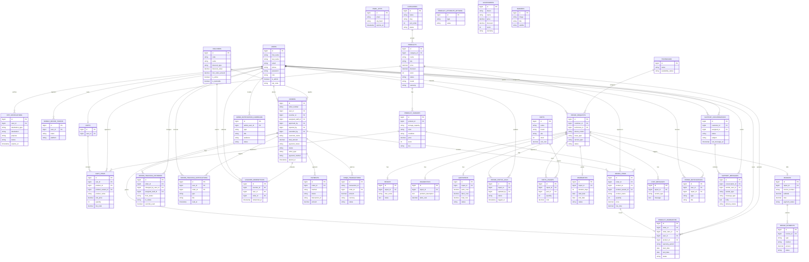

# Entity Relationship Diagram — KneaYerng Service Center

Generated from `backend/database/migrations`. Render with any Mermaid-compatible viewer (VSCode preview, GitHub, mermaid.live).

```mermaid
erDiagram
    %% ===================== USERS / AUTH =====================
    USERS {
        bigint id PK
        string first_name
        string last_name
        string email
        string phone
        string password
        string role
        boolean is_admin
        string otp_code
    }

    OTP_VERIFICATIONS {
        bigint id PK
        bigint user_id FK
        string destination_type
        string destination
        string purpose
        string status
        timestamp expires_at
    }

    EMAIL_OTPS {
        bigint id PK
        string email
        string otp_hash
        timestamp expires_at
    }

    MOBILE_DEVICE_TOKENS {
        bigint id PK
        bigint user_id FK
        string token
        string platform
    }

    %% ===================== CATALOG =====================
    CATEGORIES {
        bigint id PK
        string name
        string slug
        int sort_order
        string status
    }

    PRODUCTS {
        bigint id PK
        bigint category_id FK
        string name
        string sku
        decimal price
        decimal discount
        int stock
        string status
        string brand
        string warranty
    }

    PRODUCT_VARIANTS {
        bigint id PK
        bigint product_id FK
        string storage_capacity
        string color
        string condition
        decimal price
        int stock
        string sku
    }

    PRODUCT_ATTRIBUTE_OPTIONS {
        bigint id PK
        string type
        string value
    }

    ACCESSORIES {
        bigint id PK
        string brand
        string name
        decimal price
        decimal discount
        int stock
        string warranty
    }

    BANNERS {
        bigint id PK
        string image
        string title
        string subtitle
    }

    %% ===================== CART / ORDERS =====================
    CARTS {
        bigint id PK
        bigint user_id FK
    }

    CART_ITEMS {
        bigint id PK
        bigint cart_id FK
        bigint product_id FK
        bigint product_variant_id FK
        string product_name
        decimal unit_price
        int quantity
        decimal line_total
    }

    ORDERS {
        bigint id PK
        string order_number
        bigint user_id FK
        bigint voucher_id FK
        bigint assigned_staff_id FK
        bigint approved_by FK
        bigint rejected_by FK
        bigint cancelled_by FK
        string customer_name
        decimal total_amount
        string payment_status
        string status
        string order_type
        string payment_method
        timestamp placed_at
    }

    ORDER_ITEMS {
        bigint id PK
        bigint order_id FK
        bigint product_id FK
        bigint product_variant_id FK
        string product_name
        int quantity
        decimal price
        decimal line_total
    }

    ORDER_TRACKING_HISTORIES {
        bigint id PK
        bigint order_id FK
        bigint changed_by_user_id FK
        bigint assigned_staff_id FK
        string from_status
        string to_status
        boolean override_used
    }

    ORDER_TRACKING_NOTIFICATIONS {
        bigint id PK
        bigint user_id FK
        bigint order_id FK
        string type
        string title
        timestamp read_at
    }

    PRODUCT_WARRANTIES {
        bigint id PK
        bigint order_id FK
        bigint order_item_id FK
        bigint user_id FK
        bigint product_id FK
        string warranty_period
        date start_date
        date end_date
        string status
    }

    %% ===================== VOUCHERS =====================
    VOUCHERS {
        bigint id PK
        string code
        string name
        string discount_type
        decimal discount_value
        decimal min_order_amount
        boolean is_active
        boolean is_stackable
    }

    VOUCHER_REDEMPTIONS {
        bigint id PK
        bigint voucher_id FK
        bigint user_id FK
        bigint order_id FK
        timestamp redeemed_at
    }

    %% ===================== PAYMENTS =====================
    PAYMENTS {
        bigint id PK
        bigint order_id FK
        string method
        string status
        string transaction_id
        decimal amount
    }

    KHQR_TRANSACTIONS {
        bigint id PK
        string transaction_id
        bigint order_id FK
        decimal amount
        string currency
        string status
    }

    %% ===================== REPAIR MANAGEMENT =====================
    TECHNICIANS {
        bigint id PK
        string name
        string availability_status
    }

    REPAIR_REQUESTS {
        bigint id PK
        bigint customer_id FK
        bigint technician_id FK
        string device_model
        string issue_type
        string service_type
        string status
    }

    INTAKES {
        bigint id PK
        bigint repair_id FK
        string imei_serial
        text notes
    }

    DIAGNOSTICS {
        bigint id PK
        bigint repair_id FK
        text problem_description
        decimal labor_cost
    }

    QUOTATIONS {
        bigint id PK
        bigint repair_id FK
        decimal parts_cost
        decimal labor_cost
        decimal total_cost
        string status
    }

    REPAIR_STATUS_LOGS {
        bigint id PK
        bigint repair_id FK
        bigint updated_by FK
        string status
        timestamp logged_at
    }

    PARTS {
        bigint id PK
        string name
        string brand
        string sku
        int stock
        decimal unit_cost
    }

    PARTS_USAGES {
        bigint id PK
        bigint repair_id FK
        bigint part_id FK
        int quantity
        decimal cost
    }

    WARRANTIES {
        bigint id PK
        bigint repair_id FK
        int duration_days
        date start_date
        date end_date
        string status
    }

    INVOICES {
        bigint id PK
        bigint repair_id FK
        string invoice_number
        decimal subtotal
        decimal total
        string payment_status
    }

    REPAIR_PAYMENTS {
        bigint id PK
        bigint invoice_id FK
        string type
        string method
        decimal amount
        string status
    }

    CHAT_MESSAGES {
        bigint id PK
        bigint repair_id FK
        string sender_type
        text message
    }

    REPAIR_NOTIFICATIONS {
        bigint id PK
        bigint user_id FK
        bigint repair_id FK
        string type
        string title
    }

    %% ===================== SUPPORT CHAT =====================
    SUPPORT_CONVERSATIONS {
        bigint id PK
        bigint customer_id FK
        bigint assigned_to FK
        string status
        string subject
        timestamp last_message_at
    }

    SUPPORT_MESSAGES {
        bigint id PK
        bigint conversation_id FK
        bigint sender_user_id FK
        string sender_type
        string message_type
        text body
        string delivery_status
    }

    %% ===================== ADMIN =====================
    ADMIN_NOTIFICATION_CAMPAIGNS {
        bigint id PK
        bigint admin_user_id FK
        string type
        string title
        string audience
        string status
    }

    %% ===================== RELATIONSHIPS =====================
    USERS ||--o{ OTP_VERIFICATIONS : verifies
    USERS ||--o{ MOBILE_DEVICE_TOKENS : registers

    CATEGORIES ||--o{ PRODUCTS : groups
    PRODUCTS ||--o{ PRODUCT_VARIANTS : has

    USERS ||--o| CARTS : owns
    CARTS ||--o{ CART_ITEMS : contains
    PRODUCTS ||--o{ CART_ITEMS : "appears in"
    PRODUCT_VARIANTS ||--o{ CART_ITEMS : "appears in"

    USERS ||--o{ ORDERS : places
    VOUCHERS ||--o{ ORDERS : applies
    ORDERS ||--o{ ORDER_ITEMS : contains
    PRODUCTS ||--o{ ORDER_ITEMS : "appears in"
    PRODUCT_VARIANTS ||--o{ ORDER_ITEMS : "appears in"
    ORDERS ||--o{ ORDER_TRACKING_HISTORIES : logs
    USERS ||--o{ ORDER_TRACKING_HISTORIES : changes
    USERS ||--o{ ORDER_TRACKING_NOTIFICATIONS : receives
    ORDERS ||--o{ ORDER_TRACKING_NOTIFICATIONS : triggers

    ORDERS ||--o{ PRODUCT_WARRANTIES : grants
    ORDER_ITEMS ||--o| PRODUCT_WARRANTIES : covers
    USERS ||--o{ PRODUCT_WARRANTIES : owns
    PRODUCTS ||--o{ PRODUCT_WARRANTIES : "warrants"

    VOUCHERS ||--o{ VOUCHER_REDEMPTIONS : "used in"
    USERS ||--o{ VOUCHER_REDEMPTIONS : redeems
    ORDERS ||--o| VOUCHER_REDEMPTIONS : redeems

    ORDERS ||--o{ PAYMENTS : payment
    ORDERS ||--o{ KHQR_TRANSACTIONS : "paid via"

    USERS ||--o{ REPAIR_REQUESTS : requests
    TECHNICIANS ||--o{ REPAIR_REQUESTS : assigned
    REPAIR_REQUESTS ||--o| INTAKES : has
    REPAIR_REQUESTS ||--o| DIAGNOSTICS : has
    REPAIR_REQUESTS ||--o| QUOTATIONS : has
    REPAIR_REQUESTS ||--o{ REPAIR_STATUS_LOGS : logs
    USERS ||--o{ REPAIR_STATUS_LOGS : updates
    REPAIR_REQUESTS ||--o{ PARTS_USAGES : uses
    PARTS ||--o{ PARTS_USAGES : "used in"
    REPAIR_REQUESTS ||--o| WARRANTIES : grants
    REPAIR_REQUESTS ||--o| INVOICES : bills
    INVOICES ||--o{ REPAIR_PAYMENTS : "paid via"
    REPAIR_REQUESTS ||--o{ CHAT_MESSAGES : has
    USERS ||--o{ REPAIR_NOTIFICATIONS : receives
    REPAIR_REQUESTS ||--o{ REPAIR_NOTIFICATIONS : triggers

    USERS ||--o{ SUPPORT_CONVERSATIONS : opens
    USERS ||--o{ SUPPORT_CONVERSATIONS : "assigned to"
    SUPPORT_CONVERSATIONS ||--o{ SUPPORT_MESSAGES : contains
    USERS ||--o{ SUPPORT_MESSAGES : sends

    USERS ||--o{ ADMIN_NOTIFICATION_CAMPAIGNS : creates
```
